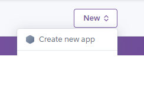
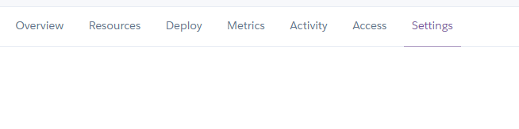
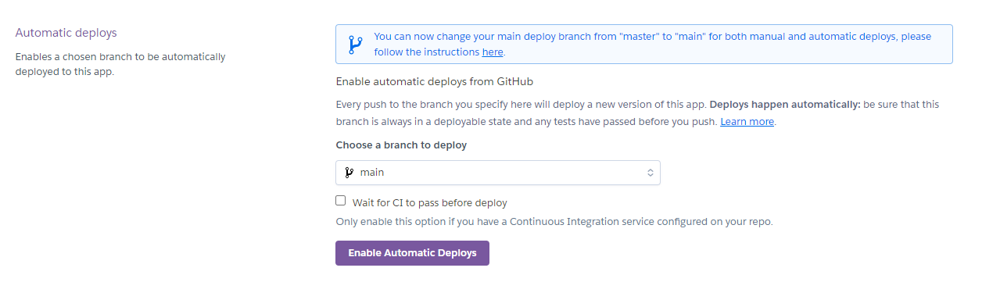

# Black Jack 21 game

BlackJack21 is a python terminal game, which is run on the Code Institute mock terminal on Heroku. 

It is an enjoyable betting game that is played against a dealer, which in this case is the computer. It is played with playing cards and the aim is to get as close to 21 as possible, without exceeding it. You win if you get 21 or beat the value of the dealers cards without exceeding 21.

[Here is the live version of the project](https://black-jack21-fa4b7e8cb0bf.herokuapp.com/)

When Black Jack is played at casinos it is often multiple people against a dealer. As it only requires a pack of cards and can be played one on one (with one person taking the role of dealer) it has also been popular family entertainment with or without the betting. This version is one on one and includes betting. For a more complete history see [Wikipedia](https://en.wikipedia.org/wiki/Blackjack)

## Flow chart

### Initial flow chart 

I proposed the initial design of the game using a flow-chart and document that I put together with my thoughts.

[idea document page 1](document/design-thoughts-1.png)

[idea document page 2](document/design-thoughts-2.png)

These ideas and flow chart have been fairly accurately followed to produce the final product.

Although, from the outset discussion the split (when you have identical cards) was discarded. This is a rare occurance so won't subtract significantly from the game play, therfore, won't impact user experience. It would also be difficult to test and involve putting in specific cards, due to it's rarity in random occurrence. These combined factors made it a low value function at high testing cost, so it was dropped.

## How to play

1. Initially you enter your name, so the experience can be personalised
2. Then you place a bet without knowing the cards by typing a whole number that is less than or equal to your credit.
3. The cards will then be dealt. Two each for you and the dealer, one of the dealers cards will be held in the hole until his turn (so you can't see his second card).
4. You can Hit (get one more card then decide again), Stick (stay where you are and it is the dealers turn) or Double down (which doubles the bet and gives you only one more card - before the dealers turn).
5. Your cards are worth their face value if they are a number card. Jack, Queen and King are worth 10. Ace can be worth 1 or 11 depending on what is best for the hand.
6. If you exceed 21 then you will lose your bet. 
7. If you don't exceed 21 and have stuck or doubled down then the dealers/computers turn commences. You will get to see the dealers second card (along with the first) and if he gets additional cards you will see those dealt.
8. If the dealer gets higher than you without exceeding 21 he wins, if he exceeds 21 you win and if you have the higher value you win. 
9. If you win the winnings will be paid into your credit.
10. If you get 21 it is an instant payout and gets a higher return than just beating the dealer.
11. Matching values get your bet returned to you.

## Features

### Existing Features

#### Building a random pack of cards

1. List comprehension was used to create the deck of cards and then it was held in a constant. This works with a nested *for* in *for* loop. One for loop works through the suits and one works through the values, each time outputting a dictionary entry for the suit and value/name. This ends up with every combination of value and suit.

2. These cards are shuffled using the *random.sample* function. This information was developed from [W3](https://www.w3schools.com/python/ref_random_sample.asp) which showed that you could input the sequence and length of the sequence and it would return a shuffled list. So the cards and 48 were the two arguements, as 48 is the number of cards in a deck.

#### Name

A name was *input* in *request_name* so that other parts of the program could be personalised (or if multiple player functionality was introduced it differentiated between players). This was validated and formatted with code developed from:

-  [*contains*](https://www.askpython.com/python/string/python-string-contains) to check for white space and tab (so name doesn't make string literals too long if spaces in middle).
- [*isalpha()*](https://www.w3schools.com/python/ref_string_isalpha.asp) ensures that it is only letters.
- [*strip()*](https://www.freecodecamp.org/news/python-strip-how-to-trim-a-string-or-line/) to remove white space from each end.
- [*capitalize()*](https://www.w3schools.com/python/ref_string_capitalize.asp) to make just the first letter a capital, irrespective of what combination of capitals and lower case was entered.
- [*len()*](https://www.w3schools.com/python/ref_func_len.asp) was used to make sure the person hadn't just pressed enter or white space or tab. It was also used to restrict the name length so it didn't interfer with layout of string literals when used.

#### Betting 

Betting was done via an *input*, in the function *request_bet* which was then validated to ensure that it was an integer (not a special character, letter etc.) developed from [pynative](https://pynative.com/python-check-user-input-is-number-or-string/) using a *try* function that looked to see if the string could be turned into an integer. It was also necessary to ensure that it was a positive number *if* statement* and there was sufficient credit - *check_credit* - credit greater than or equal to value held in the game (as *credit*) to allow the bet to be made.

#### Menus

The next user input that was required was a menu. All menus throughut the project were from a third party module [simple-term-menu](https://pypi.org/project/simple-term-menu/). This could provide more complex menus such as hit, stick, double down or quit, or yes/no menus. This menu system was already validated so didn't require any validation.

#### Timing for impact

1. It was important for the game to have appropriate timing. So that everything was on the screen for long enough for the player to read or build suspense when the cards are being dealt. This was performed from the *sleep* function from the built in library of [*time*](https://www.simplilearn.com/tutorials/python-tutorial/sleep-in-python#:~:text=The%20sleep()%20function%20in,the%20given%20number%20of%20seconds).

2. During the instructions being read it is not possible to guess how long individuals will take to read, so in addition to *sleep* function, when it reached the bottom of the page a *press enter key to continue* function was used. This was discovered from [geeks for geeks](https://www.geeksforgeeks.org/make-python-wait-for-a-pressed-key/)

#### Readability

Readability is a big factor as the terminal is limited in what can be displayed.

1. It was essential to remove extraneous information from the screen once it was no longer required. OS clear screen adapted from [clear](https://www.geeksforgeeks.org/clear-screen-python/). To keep the screen consistent (apart from in instructions where space was needed) ASCII title, credit and where appropriate bet were always at the top of the screen

2. Readability also was improved by the use of colours from [colorama](https://pypi.org/project/colorama/).

3. Simplistic reading of the cards was aided by the use of emojis. The initial idea to use the cards emojis. This idea was quickly disregarded when it became apparent that they were unreadable due to size on the terminal output, so a crown and the emojis for the suits were used instead. This was taken from [emoji](https://pypi.org/project/emoji/). It was attempted to also do the Jack, King and Queen with their own emoji's but the available emoji's didn't make that clear. So it was decided just to have a crown to show that they were court cards.

4. To make the code more readable it and not so bulky, additional *x.py* files were created. This allowed bulky string literals to be taken out of the code (some were left in where they were one line, or required global variables to be available, or if the information described what the code was doing). An *ascii.py* was created as this was just pictorial and not needed to for anyone reading the code. Generating the cards was also grouped and put in *cards.py*. More could have been done on this if time allowed.

5. A dictionary of the emojis was also taken out of the *run.py* as it was originally set up as a *if/elif* with each emoji having it's own line. The dictionary in a different file was easier to read and out of the way. 

#### Making a card not visible (putting it in the hole)

This was done using [numpy](https://numpy.org/doc/stable/reference/) and it's indexing features. I learnt about these while studying for my PCEP-30-02 from the python institute. This allowed me to print a string rather than the card for a specific index under certain circumstances. The numpy array allows indexing and itteration through it which means you can be specific with different entries.

#### Calculations

Calculations were all done using basic adding, subtracting, dividing etc. functionality available in python. These were needed to deal with betting, credit and calculating the value of the hands. Strings were turned to integers either using *int* or *if* "certain string" = certain value.

#### Running out of cards

It is possible that if the player continues through many rounds that the deck of cards will run out. Therefore, when this occurs an additional deck of cards is shuffled and added to the end of the pack. The adding to the end of the deck was done using code develped from [W3](https://www.w3schools.com/python/gloss_python_join_lists.asp) to extend list to add two decks together
 
#### End of game

It is necessary to end the game when the user is out of credit or wishes to. This was done via a quit function from [scaler](https://www.scaler.com/topics/exit-in-python/). The display put up goodbye in ASCII and then exits the program to let the player know that they are finished.

### Potential Future features

#### Mulitiple players

It would be possible to add several players to the game by asking how many players there were, up to a set number, then setting up those players hands separately, with a reference to the name that they gave initially. This could have the hand class adjusted to include a name and then that could contain all the information on that players cards and status.

Then when the first player had gone bust or stuck it could ask the players to hand the game over to the next named player and use a menu to confirm when they had.

This would be more similar to a casino version of the game when usually several people sit around a table with one dealer and the dealer only goes once everyone has finished their turn.

#### Split

Split was in the original idea, but wasn't worth including in this limited version. Split is something that could be added to the game where if the player has two identical value cards they are allowed to make the two cards the first card in two hands and place their original bet against both hands. 

#### Code improvements

There are several things that if time had allowed or were considered lower value items so were not implemented.

1. A dictionary of values for the court and Ace cards rather than the *if* string = then give value. This could go into another *.py file. This idea of dictionaries was only suggested at the end stages of implementation, so done for the emoji's but not values of court cards. 

2. Put more strings and functions into either the strings.py or additional files to make the code more readable and logical. This was started but could definitely be taken further.

3. Global variable were taken out of code as far as possible. Due to my inexperience I excessively used global variables, I am now aware that this is bad practise. I am now familiar with using *return* instead. Once again significant improvments were made taking out many of the simple global values but the time to take out where I had used several in a function and the risk to breaking the working code at this late stage was considered not practical.

## Bugs

### Ace 1 or 11

Developing a function that would allow me to either produce a value of 1 or 11 when the Ace was dealt was quite challenging.

- Initial strategy was to add everything up and they try both the 1 and the 11. However, this proved to be extremely complicated and required excessive code. So being as I had not successfully completed this code when the calculations showed me that there were specific number limits each time I stopped this approach.

- Using a combination of the specific total values prior to adding the Aces and the number of aces being added (number of aces can only be 0 to 4) gave a significant simplification of the code. It also aligns with Dealers always stopping at 17 as that is the point where the probability of winning changes. So this made sense.

- The final simplification involved using just a couple of lines of code with addition in the line of code, rather than many lines of for and if, when the value was only changing by one.

### Not using equal to or greater than just greater than
I had two examples where the greater than logic was not what was intended. In both cases I had intended equal to or greater than and only used greater than.

1. When checking that the player had sufficient credit to be able to place a bet I put > 1, but obviously there is not reason why a bet of 1 could not be placed. The logic should either be > 0 or >=1. This was discovered when a player tried to bet 1.
2. During the development of the Ace function I used greater than for my limit numbers when they should have been >= which meant that for Black Jack (21) my calculation was giving the Ace a value of 1 when it should be 11 to equal 21.

### Initial input held instead of latest input

Due to the ordering of the actions in my code the input of a bet took a value and then validated it. Often the first input was kept rather than the one passing validation.

- If the value failed validation then it asked for another value. During various attempts at the code it either held the initial input (which was the first bug to deal with) and ignored later inputs or as I moved through improving the code either the calculations or the values given to the player on screen were from the wrong iteration. 
- This was eventually worked through by working step by step thorough the code with each error till I found where it was in the wrong order. Eventually, although not best practise, it was decided to put Bet as a global variable so that all the other functions were working from the same source, rather than returning the value. 
- Potentially with additional work this could be sorted out in to a return again, but currently as it is working and there were more important concerns it was left to be improved (if time) later.

### Infinite loop

The dealer time was stuck in an infinite loop while the function was being developed as the part of the function that dealt an extra card hadn't been put in so it kept checking if the value exceeded 17 and as no action had occurred to change the value (no new cards to add in) it went round the loop. 

This took a few times to realise as sometimes the initial draw was above 17 so it was an intermittent fault.

### CodeAnywhere issues

Due to an issue with code institute credits on codeanywhere not being set to infinite credit before this project, there is a slight gap when I couldn't commit to Git. During this time I just worked on the README, to reduce loss of traceability within the code.

## Testing

### Functions test

check|intended outcome|comment|pass y/n
---|---|---|----
User name only accepts letters|Specific error for anything that isn't automatically corrected|Tried letters (with and without spaces inside and out of word), special characters, 0, numbers, blank space, tab, enter, longer than one line and e - all gave correct error messages when relevant|Yes|
Bet input only accepts positive numbers|Specific error for anything that isn't a positive number within credit|Tried numbers - in and out of credit, letters, special characters, 0, negative numbers, blank space, tab, exact amount of credit, enter and e - error messages where relevant|Yes|
Game runs in correct order of functions |Plays as expected|Nothing unexpected|Yes|
Adding up of card values gives correct person winning|User or Dealer wins or loses correctly against cards|Values matched testers calculations, checked Ace, King, Queen, Jack and multiple number cards|Yes|
Credit system has correct amount added and subtracted|Credit relates to bets won and lost|Values matched testers calculations|Yes|
No issues with moving to second deck|Next deck cards play without interruption|Pressed Hit over 100 times which with the initial deal means the cards were at least in third pack|Yes|
Enter to continue|Instructions requires enter to continue - error other keys|Tried letters, numbers and special characters - correct error message when relevant|Yes
Each winning or loosing option correct|Correct outcome|21, bust for dealer and player, win, loose and scores tied tested|Yes
Menus give correct action|Correct function called from choice|All menu options tested|Yes|
Play another round works|Next round has cleared hands and bet to work as an independent round while credit retained|Values matched anticipated|Yes|
Ends as expected when requested|says goodbye and tell you credit|Credit and goodbye present|Yes|
When you run out of credit it ends the game|says goodbye and tells you that you ran out of credit|Purposefully lost|Yes|
--------------

### User stories

#### New to game

Read instructions and played the game with random choices to give impression of no strategy - played as expected.

#### Repeat user

Played with strategy to win, making appropriate bets and card choices - played as expected.

#### Family member testing

My family played the game and said it played as they remembered from card games during my childhood (except we had no betting).

## Validator

[PEP8Online.com](https://pep8ci.herokuapp.com/) was used to validate this project. No errors was found in the final deployed version.

## Technology used

### Language

- [python 3.11.5](https://docs.python.org/3/)

### Other technologies

- [codeanywhere](https://codeanywhere.com/beta) was used to write the code
- [pythontutor](https://pythontutor.com/visualize.html#mode=edit) to allow me to work through my code in small sections
- [Heroku](heroku.com) was used to deploy.
- [Github](https://docs.github.com/en) used for version control.
- code institute mock terminal

### Third part libraries

- [colorama 0.4.6](https://pypi.org/project/colorama/) was used to highlight signficant text so that it would be more readable.
- [emoji 2.8.0](https://pypi.org/project/emoji/) was used to introduce images that made the information more easily interpreted by the user.
- [numpy 1.24.4](https://numpy.org/doc/stable/reference/) allows the sequencing of arrays.
- [simple-term-menu 1.6.1](https://pypi.org/project/simple-term-menu/) gave a simple menu that could be adapted to allow for relevant menus

## Deployment

1. [Heroku](heroku.com) was used to deploy.
2. Once logged onto the website, using the drop down menu in the top right we went to the dashboard.

3. From here we are able to create a new app either by clicking on the icon (which is what we did)

or the drop down menu

4. Next the app was named black-jack21 and the Europe region chosen in these feilds

and the purple 'create' button was pressed.

5. In the menu navigation bar the settings was selected

6. The section with Config Vars was then opened up by clicking the Reveal Config Vars button

7. The port was set to 8000

8. The build packs were then chosen, firstly the purple button add build packs was pressed, then the icon for python. The purple button for add build packs was pressed again and the icon for JSNode

9. Now we used the menu navigation bar again, this time to select deploy

10. The deployment method was selected by clicking on the GitHub icon and it stated that it was connected to github

11. The repository was chosen by searching my github

12. Automatic deployment was chosen so that it would update every time the changes were pushed to git

13. It was deployed

## Credit

- Code institute for the knowledge base that I developed from their course material and the deployment terminal.

- The ASCII larger writing was taken from [patorjk.com](http://patorjk.com/software/taag/#p=display&h=2&v=2&f=Univers&t=BlackJack21) and cut and paste into print f string statements using the style Calvin S.

- My grandparents for amazing patience teaching me the game when I was learning to add up.

- Pat Walmsley and Ian Harris - My mother and partner for their patience.

- My Mentor - Juliia Konn has been enthusiastic and provided encouragement and spotted details that I was only vaguely aware of and taught me to look for them.

- [Wikipedia](https://en.wikipedia.org/wiki/Blackjack) for reminding me to the details of the game.

- [pythontutor](https://pythontutor.com/visualize.html#mode=edit) for working through my code.

- [Heroku](heroku.com) for deployment.

- [Github](https://docs.github.com/en) for version control
- [colorama 0.4.6](https://pypi.org/project/colorama/) for coloured text.
- [emoji 2.8.0](https://pypi.org/project/emoji/) for emoji's.
- [numpy 1.24.4](https://numpy.org/doc/stable/reference/) to work with arrays.
- [simple-term-menu 1.6.1](https://pypi.org/project/simple-term-menu/) for menus.

